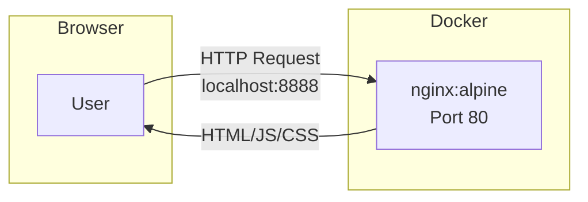
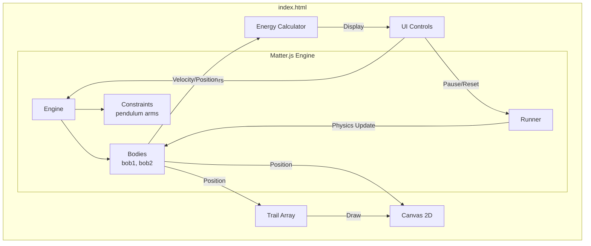
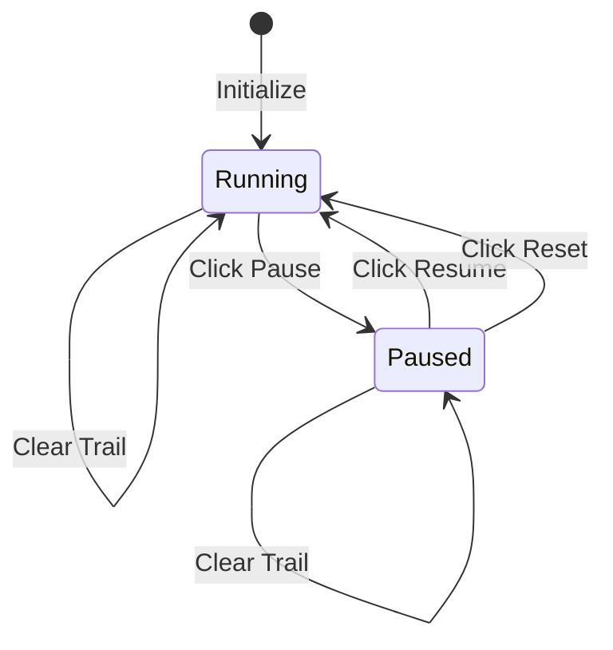

# アーキテクチャドキュメント

## ディレクトリ構成

```
double-pendulum/
├── PROMPT.md           # 要求仕様
├── README.md           # プロジェクト概要
├── Dockerfile          # コンテナイメージ定義
├── docker-compose.yml  # コンテナ実行設定
├── .gitignore          # Git除外設定
├── doc/
│   └── architecture.md # 本ドキュメント
└── src/
    ├── index.html      # メインアプリケーション
    └── summary.html    # プロンプト要約ページ
```

## 使用ライブラリ一覧

| ライブラリ | バージョン | 用途 |
|-----------|-----------|------|
| Matter.js | 0.19.0 | 2D物理エンジン（二重振り子のシミュレーション） |

その他はバニラJS（ライブラリなし）で実装。

## コンテナレベルのデータフロー



## モジュールレベルのデータフロー



## 状態遷移図



## 物理シミュレーション

### Matter.js による実装

二重振り子は以下の構成で実現:

1. **固定点（Pivot）**: Canvas上部中央に配置
2. **Bob1**: 最初の振り子の重り（Circle Body）
3. **Bob2**: 2番目の振り子の重り（Circle Body）
4. **Constraint1**: Pivot と Bob1 を接続
5. **Constraint2**: Bob1 と Bob2 を接続

```javascript
// Constraint による振り子の接続
constraint1 = Constraint.create({
    pointA: pivot,      // Fixed point
    bodyB: bob1,        // First bob
    length: params.length1,
    stiffness: 1,
    damping: 0
});

constraint2 = Constraint.create({
    bodyA: bob1,        // First bob
    bodyB: bob2,        // Second bob
    length: params.length2,
    stiffness: 1,
    damping: 0
});
```

### エネルギー計算

- **運動エネルギー**: `KE = 0.5 * m * v²`
- **位置エネルギー**: `PE = m * g * h`（Pivotを基準）
- **全エネルギー**: `E = KE + PE`

## レスポンシブ対応

| 画面 | レイアウト |
|------|-----------|
| デスクトップ (>=768px) | 横2カラム（Canvas + Controls） |
| モバイル (<768px) | 縦積み |
| 縦長 (9:16) | コンパクトなUI、Canvas優先 |
